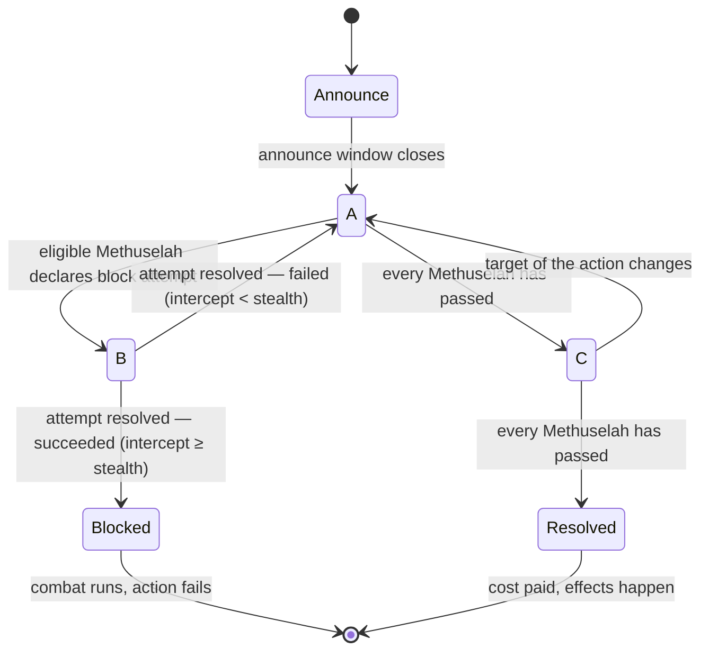

# Impulse & Window State Machine — Design

**Status: AGREED (owner approved 2026-07-18) — verified against the official
V5 rulebook.**
Every rules claim below has been checked against the Fifth Edition rulebook
PDF (page references cite that document; "FAQ" and "Rulings" refer to its
FAQ / Card Rulings chapters, p. 45–50). Direct quotes are marked. No engine
code exists yet; this document is reviewed with the owner first (CLAUDE.md,
phase 2). Section 10 lists every citation and what it settled — including
the places where the rulebook **corrected** the first draft of this design.

---

## 1. What this machine must do

VTES sequencing is written as prose ("the acting Methuselah may…", "then
each other Methuselah in turn…"). The engine needs it as an explicit state
machine because of three settled architecture principles:

1. At every instant the engine must know **whose decision it is** and the
   **complete list of legal options** (legal-move generator). There is no
   "waiting for anyone who wants to respond" — that concept doesn't exist
   in a headless engine.
2. Cards must plug into the sequence via **registered handlers**, never by
   special-casing the loop.
3. The whole thing must be **serializable mid-decision** (event sourcing,
   replays, reconnection) and **deterministic**.

Concrete sequencing features it must express:

- The **universal sequencing rule** ("impulse", rulebook p. 8) that governs
  every stage of the game.
- The action lifecycle, including the rulebook's literal block-attempt
  states **A / B / C** ("Detailed course of an action", p. 27).
- The **"as played"** cancellation window around every card play,
  including nesting.
- **Wake effects**: locked minions gaining the right to react.
- **Combat** as a sub-machine: seven steps per round (p. 29).

## 2. Core model

Game state is plain data plus a **frame stack** — a pushdown automaton.

- A **frame** is one nested sequencing context: a turn, a phase, an action,
  a block attempt, a combat, a single card being played. Frames push when a
  context opens and pop when it resolves. Nesting is free: a Deflection
  played during an action is a `CardPlayFrame` on top of an `ActionFrame`;
  a cancel effect used against that Deflection is another `CardPlayFrame`
  on top of that.
- Each frame is a small named state machine. The **top frame's state**
  determines the current **window**.
- A **window** is a named opportunity: *these seats*, in *this order*, may
  use *effects legal in this window*, or pass.
- The **impulse** is which single seat the current window is asking right
  now — always derivable from (top frame, frame state, pass bookkeeping),
  never stored redundantly.

The engine loop (identical for human, AI, and future multiplayer host):

```
loop:
  frame  = top of stack
  window = frame.currentWindow()
  seat   = window.impulseHolder()
  opts   = legalOptions(seat, window, state)   // always ≥ 1; Pass when legal
  choice = agents[seat].decide(decisionPoint, opts, playerViews[seat])
  apply(choice)   // emits events, may push/pop frames, advances frame state
```

`legalOptions` is a pure function of state. `apply` is the only mutator,
and it mutates only by emitting events (event sourcing: the game is the
initial state + the sequence of chosen options).

### 2.1 The universal sequencing rule (the "impulse cycle")

The rulebook defines **one** sequencing rule that applies at every stage
(p. 8, Advanced Rules — Sequencing), quoted:

> "If two or more Methuselahs want to play a card or effect, the acting
> Methuselah plays first. At every stage, the acting Methuselah always has
> the opportunity (called 'impulse') to play the next card or effect. So
> after playing one effect, they may play another and another. Once they
> are finished, the impulse passes to the next Methuselah in the following
> order: during combat or an action directed at a single Methuselah, the
> defending Methuselah first; during an action directed at a set of
> Methuselahs, those Methuselahs in clockwise order; during an undirected
> action, the prey first and the predator second. Then every other
> Methuselah in clockwise order gets the impulse until everyone passes.
> Note that if at any point any Methuselah uses a card or effect, the
> acting Methuselah again gets the impulse back."

This becomes one reusable engine component, the **impulse cycle**,
parameterized by an ordered seat list:

- `order = [acting, …defenders per context…, …everyone else clockwise…]`
- The impulse walks `order` from the front. Playing any effect **rewinds
  the impulse to the front of the order** (the acting Methuselah).
- The cycle (and therefore the window) closes when every seat in `order`
  passes consecutively — **quiescence**.
- Termination is guaranteed: every rewind requires someone to have spent a
  card or a bounded effect.

Every window in the game runs this same protocol; only the `order` list
and the set of legal effects differ. In combat, the same rule appears as
"the acting minion always gets first opportunity to use cards or effects
before the opposing minion at every stage of combat" (p. 29).

**Passing and coming back:** passing the impulse does *not* burn your
right to play effects later — the rewind rule brings the impulse back
around. The one exception is **block declaration**: a Methuselah who
passes in action state A forfeits blocking for the rest of the action
unless the target changes (§3.3). The engine therefore tracks two distinct
things: the impulse cursor (transient, rewinds freely) and the per-seat
`declinedBlocks` flag (sticky, cleared only by a target change).

### 2.2 The frame catalogue

| Frame | Pushed when | Popped when | Internal states |
|---|---|---|---|
| `TurnFrame` | a Methuselah's turn begins | turn ends | one state per phase: unlock → master → minion → influence → discard (phases are states of the turn frame, not separate frames — phases never nest, so a frame of their own bought nothing) |
| `ActionFrame` | a minion takes an action | action resolves or is blocked/ended | Announce → A / B / C → resolution (§3) |
| `BlockAttemptFrame` | a block attempt is declared | attempt resolves (success/failure) | one impulse cycle (§3.4) |
| `CombatFrame` | successful block, or card effect | combat ends | 7 steps per round (§5) |
| `CardPlayFrame` | any card/effect is played | card resolves or is canceled | as-played window → resolve (§4) |
| `ReferendumFrame` | a political action succeeds | referendum resolved | terms → polling → resolve *(phase 3+; noted so the shape is planned for; polling has bespoke rules — votes castable in any order, immutable once cast, p. 28)* |

The stack replaces both "the current step of the turn" and "what are we in
the middle of" — there is no separate program counter anywhere.

### 2.3 Window catalogue

Window IDs are the stable vocabulary card handlers, tests, and the debug
UI speak. They map 1:1 onto card-text timing templates:

| Window | Opens | Card-text template it serves |
|---|---|---|
| `turn.minion` | minion phase, between actions | choosing actions |
| `action.announce` | right after announcement | "as the action is announced" — must be played **before** regular modifiers/reactions (p. 25) |
| `action.effects` | states A, B, C (frame state visible to predicates) | action modifiers "at any time before resolution"; reaction cards; block declaration (A only); Deflection "after blocks are declined" |
| `card.asPlayed` | any card play | cancel-as-played effects and wake effects **only** (p. 7) |
| `combat.beforeRange` | round step 1 | "before range is determined" |
| `combat.range` | round step 2 | maneuvers |
| `combat.beforeStrikes` | round step 3 | "after range, before strikes" |
| `combat.chooseStrike` | round step 4 | strike selection |
| `combat.damageResolution` | round step 5 | damage prevention |
| `combat.press` | round step 6 | presses |
| `combat.endOfRound` | round step 7 | "end of round" effects (runs even if combat ended prematurely, p. 32) |

## 3. The action lifecycle (states A / B / C)

The rulebook defines this exactly ("Detailed course of an action", p. 27).
The `ActionFrame` implements it verbatim:



### 3.1 Announce

All details of the action are defined at announcement: target(s), cost,
effects (p. 25). Any action card is played face up but set aside **out of
play** until resolution. The acting minion **locks at announcement**.
Directed vs undirected is fixed here: an action targeting other
Methuselahs or things they control is **directed** (only targeted
Methuselahs may block, clockwise order if several); anything else is
**undirected** (prey may block first, then predator) (p. 25). Political
actions are always undirected.

Then the `action.announce` window runs one impulse cycle for cards that are
"played as the action is announced" — these must come before regular
modifiers and reactions (p. 25; FAQ p. 46 confirms even the acting player
cannot lead with a bleed modifier at announcement time).

Cost note: the action's cost is **not** paid at announcement — it is paid
at resolution, only if the action succeeds (p. 27).

### 3.2 State A — no current block attempt

One impulse cycle in `action.effects`. Legal here, per seat:

- Acting Methuselah: action modifiers (acting minion only; a modifier
  doesn't require the minion to be unlocked — Rulings p. 48, Cloak the
  Gathering; same card once per action).
- Other Methuselahs: reaction cards via ready unlocked (or woken) minions
  (reactions don't lock the minion; same card once per action per minion).
- A Methuselah eligible to block, whose `declinedBlocks` flag is unset:
  **declare a block attempt** → push `BlockAttemptFrame`, state → B.
- **Passing in state A sets that Methuselah's `declinedBlocks` flag** —
  "that Methuselah cannot declare any block attempt until the end of the
  action unless the target of the action changes" (p. 27, A.3). "Once a
  Methuselah decides not to make any further attempts to block, that
  decision is final" (p. 25).

Every Methuselah passed → state C.

### 3.3 State B — an ongoing block attempt

The `BlockAttemptFrame` names the blocking minion. Rules while it exists
(p. 27, B):

- The sequencing rule applies as normal — same impulse cycle, **not** a
  special ping-pong (this corrected the first draft, see §9.6).
- **The target of the action cannot be changed** (so no Deflection during
  a block attempt).
- No other minion can attempt to block until this attempt is resolved.

The stealth/intercept back-and-forth emerges from *legality predicates*,
not from impulse changes ("Stealth and Intercept", p. 26):

- **Stealth effects are legal only "when needed"**: only while the action
  is currently being blocked and the blocker's intercept ≥ acting minion's
  stealth (Rulings p. 47, Bonding, confirms: you cannot play a stealth
  card when you don't need it).
- **Intercept effects are legal only "when needed"**: only for the
  blocking minion, while the acting minion's stealth > their intercept.
- All stealth/intercept modifications last for the duration of the action.

When every Methuselah has passed (quiescence), the attempt resolves by one
comparison (p. 26): **blocked if the blocker's intercept ≥ the acting
minion's stealth**.

- **Success** → state `Blocked`, with two *simultaneous* consequences
  (p. 27): the blocking minion locks, and the two minions enter combat
  (push `CombatFrame`). If an effect ends the action before block
  resolution, *neither* consequence occurs (Rulings p. 48, Change of
  Target: the blocker isn't even locked).
- **Failure** → pop the frame, back to state A. A failed attempt does
  **not** lock the blocking minion, and the same or another minion of that
  Methuselah may attempt again, as often as they wish (p. 25). A minion
  who failed to block may still play reactions such as Deflection
  (Rulings p. 48, Faceless Night).

### 3.4 State C — blocks declined by all

Effects can still be played — one more impulse cycle (p. 27, C). This is
where the endgame of a bleed plays out (FAQ p. 46): the target has
declined to block, the acting Methuselah gets the impulse back and may now
pump the bleed, and *then* the target may play Deflection.

- **If the target of the action changes → back to state A.** All
  `declinedBlocks` flags are cleared for re-evaluation ("this will reopen
  block attempts, following the normal rules", p. 26; FAQ p. 46: a bleed
  redirected back to you opens a new blocking window).
- Every Methuselah passed → the action **resolves**: cost paid, effects
  happen.

### 3.5 Resolution

Successful: cost paid, effects take place. For a bleed: the target burns
pool equal to the bleed amount; if the action succeeded *and the bleed
amount is ≥ 1*, the controller of the acting minion **takes the Edge**
from whoever holds it (p. 21) — regardless of who the final target is, so
a deflected bleed gives the Edge for free. A bleed of 0 is a successful
action but not a successful bleed: no Edge (FAQ p. 46).

Blocked: the action card (if any) is burned, the cost is **not** paid, the
action's effects do not happen (p. 27). Costs of action modifiers and
reaction cards are always paid when played, win or lose.

Either way the `ActionFrame` pops; the acting minion stays locked (until
the unlock phase or an unlocking effect — a minion that unlocks mid-phase
may act again, p. 19).

## 4. Card plays and the "as played" window

Playing *any* card or effect pushes a `CardPlayFrame`:

1. The card is announced and shown (non-action cards pay costs when
   played; action cards defer cost to resolution, §3.5).
2. Window `card.asPlayed` runs one impulse cycle (normal sequencing
   order). **Only two kinds of effects are legal in it** (p. 7):
   cancel-as-played effects (master: Sudden Reversal; reflex cards, p. 13;
   etc.) and **wake effects** (so a locked vampire can wake in time to
   use a reaction that must itself be played in this window). A reaction
   that unlocks but does not *wake* is not playable here (p. 44).
3. If not canceled, the card resolves; the frame pops.

A cancel effect is itself a card play → nested `CardPlayFrame`, so
cancel-the-cancel needs no extra machinery.

Cancellation semantics (p. 16, "Cancel a card"): a canceled card has no
effect but **is still considered played** (once-per-action limits etc.
still count it — with the specific exception below). If an *action card*
is canceled: the minion does not lock, the cost is not paid, and they may
play the same action card again. If a *non-action* card is canceled, its
cost is still paid. If a strike card is canceled, the minion chooses
another strike.

## 5. Combat

Combat begins when a block succeeds (or from card effects). Locked/
unlocked is irrelevant in combat; only *ready* minions fight (p. 28).
`CombatFrame` runs rounds of exactly seven steps (p. 29):

1. **Before Range** — cards that say "before range is determined" (must
   come before the acting minion decides on maneuvers, p. 28).
2. **Determine Range** — default close. Maneuvers offset each other; a
   minion cannot play two maneuvers in a row; combatants may keep
   alternating as long as they wish. Using the maneuver of a strike card
   or weapon commits that strike for the round (p. 29).
3. **Before Strikes** — cards playable after range is set, before strikes.
4. **Strike** — **the acting minion chooses their strike first, then the
   opponent** (an ordered, public choice — not simultaneous or hidden;
   p. 30). Default strike: hand strike for strength damage (default
   strength 1). Then strikes resolve **simultaneously**, except: "combat
   ends" strikes resolve first of all, before even first strike; first
   strike resolves before normal strikes (p. 33–34).
5. **Damage Resolution** — per damaged minion: prevent (one card at a
   time, as chosen), then mend — a vampire burns 1 blood per unprevented
   normal damage; unmendable damage leaves them wounded → torpor.
   Aggravated damage cannot be mended; normal damage is handled before
   aggravated (p. 31–32). **Additional strikes** happen after the first
   pair: acting minion decides first; only one source of additional
   strikes per minion per round ("(limited)"); all at the same range;
   repeat choose/resolve as needed (p. 30).
6. **Press** — same offsetting protocol as maneuvers (no two presses in a
   row); an uncanceled press-to-continue starts another round; otherwise
   combat ends (p. 32).
7. **End of Round** — end-of-round effects. **This step runs even if
   combat ended prematurely** (p. 32).

Standing rule: if at any point a combatant is no longer ready, the round
and the combat end immediately (p. 30). Combat over → pop back into the
`ActionFrame` (state `Blocked`) → the action fails (§3.5).

Only combat cards can be played by minions during combat (p. 29) — except
cards explicitly playable by minions "not involved in the current combat".

## 6. Card handlers and legal-option generation

Cards register handlers into windows. Sketch of the contract (final types
land with the kernel):

```ts
interface HandlerSpec {
  cardId: number;
  window: WindowId | WindowId[];
  /** May this be offered as a legal option right now? Pure. */
  legal(ctx: WindowContext, state: GameState): boolean;
  /** Enumerate the concrete option(s), incl. targets/modes. Pure. */
  options(ctx: WindowContext, state: GameState): LegalOption[];
  /** Apply one chosen option by emitting events. */
  apply(ctx: WindowContext, choice: LegalOption, emit: Emit): void;
}
```

`legalOptions(seat, window, state)` =
built-in options for the window (pass, declare block, choose strike, …)
∪ options from every registered handler whose `legal()` passes.

The built-in legality layer enforces the general rules so individual cards
don't have to: same action-modifier/reaction card once per action per
minion; only the acting minion plays modifiers; reactions only via ready
unlocked-or-woken minions of other Methuselahs; stealth/intercept "only
when needed" (§3.3); one bleed action per minion per turn; "(limited)"
bleed-modifier exclusivity (p. 44); torpor minions can't block or react
but can play modifiers during their own actions (p. 34).

**Wake effects** need no special engine support: a wake card (e.g. On the
Qui Vive) registers for `action.effects` *and* `card.asPlayed` with a
`legal()` that accepts a locked minion; its `apply` emits an `awake`
marker scoped to the current action. Waking does **not** unlock (Rulings
p. 49). Nothing forces a woken minion to block. One template subtlety the
legality layer must know (p. 44): "Lock X **to do** Y" effects are *not*
usable by a locked-but-awake minion, while "Lock X. **Do** Y" effects are
(they lock an already-locked minion "with no effect" — exactly how basic
Deflection works from a woken vampire, Rulings p. 48).

## 7. State, determinism, events

- **Derived values are never stored.** Stealth, intercept, bleed amount,
  strength are computed by pure functions folding over the modifier events
  of the current action/combat ("all modifications … remain in effect for
  the duration of the action", p. 26 — i.e. they are action-scoped state,
  which is exactly a fold over the ActionFrame's events). When Deflection
  changes the target, nothing is "moved" — the next recomputation sees the
  new target, and block eligibility follows.
- **Events are fine-grained and past-tense** (`ActionAnnounced`,
  `CardPlayed`, `CardCanceled`, `BlockDeclared`, `BlockSucceeded`,
  `TargetChanged`, `PoolBurned`, `MinionLocked`, `EdgeTaken`, …). The UI
  animates from events; replays are event streams; invariant tests
  (counter conservation etc.) assert over them.
- **DecisionPoints are numbered.** The command log is
  `(decisionSeq, chosenOptionId)` pairs — replaying the log through the
  same engine version + RNG seed reproduces the game exactly. The frame
  stack is plain JSON data (no closures, no coroutines — §9.2), so state
  serializes mid-decision.

## 8. Traces

The two required traces, now following the verified rules. Notation: stack
top-last; `»` marks decisions. Some no-option Pass decisions are elided
from the tables for readability — per §9.4 the engine still asks each of
them (the scenario tests in `tests/engine/` encode every single decision,
un-elided).

### 8.1 Modified bleed with a Deflection redirect

Seating: **Alice → Bob → Carol** (Bob is Alice's prey, Carol is Bob's
prey). Alice's ready unlocked vampire **V1** (Dominate) bleeds; Alice
holds Conditioning; Bob holds Deflection with a ready unlocked Dominate
vampire **W**; Carol has a ready unlocked minion but declines everything.

| # | Stack / state | Window | » Choice | Effect |
|---|---|---|---|---|
| 1 | Turn/Minion | `turn.minion` | Alice: *V1 bleeds* | push ActionFrame — directed at prey Bob, bleed 1, stealth 0; **V1 locks**; cost: none (deferred anyway) |
| 2 | …/Action:Announce | `action.announce` | all pass | no "as announced" cards |
| 3 | …/Action:A | `action.effects` | Alice: pass | (FAQ p. 46: smarter to hold Conditioning until Bob declines) |
| 4 | …/Action:A | `action.effects` | Bob: pass | **Bob's `declinedBlocks` set — final** unless target changes |
| 5 | …/Action:A | `action.effects` | Carol: pass | everyone passed → state C |
| 6 | …/Action:C | `action.effects` | Alice: *play Conditioning* | push CardPlayFrame |
| 7 | …/C/CardPlay | `card.asPlayed` | all pass | (only cancels/wakes legal here) |
| 8 | …/Action:C | — | resolve | bleed modifier event → bleed = 3 ([dom] +2, "limited"); impulse rewinds to Alice |
| 9 | …/Action:C | `action.effects` | Alice: pass; Bob: *play Deflection (superior)* | legal: minion bleeding Bob, Bob has declined blocks, state ≠ B; W ready unlocked; cost 1 blood paid now; push CardPlayFrame |
| 10 | …/C/CardPlay | `card.asPlayed` | all pass | no cancels |
| 11 | …/Action:C | — | resolve | `TargetChanged Bob→Carol` (may not pick Alice); [DOM]: W not locked; **state C → A**, `declinedBlocks` cleared — new blocking window (FAQ p. 46) |
| 12 | …/Action:A | `action.effects` | Alice: pass; Carol: pass (declines block); Bob: pass | Carol's decline final; everyone passed → C |
| 13 | …/Action:C | `action.effects` | all pass | action resolves |
| 14 | …/Action:Resolved | — | — | `PoolBurned Carol 3`; bleed ≥ 1 → `EdgeTaken by Alice`; pop ActionFrame |
| 15 | Turn/Minion | `turn.minion` | Alice: next action / done | V1 still locked |

### 8.2 Blocked action into a full combat round

Same seating. V1 bleeds Bob; Bob blocks with ready unlocked minion **M**.
No stealth/intercept cards, no maneuvers, hand strikes only.

| # | Stack / state | Window | » Choice | Effect |
|---|---|---|---|---|
| 1 | Turn/Minion | `turn.minion` | Alice: *V1 bleeds* | push ActionFrame (directed at Bob); V1 locks |
| 2 | …/Action:Announce | `action.announce` | all pass | — |
| 3 | …/Action:A | `action.effects` | Alice: pass; Bob: *declare block with M* | push BlockAttemptFrame; state → B |
| 4 | …/Action/Block:B | `action.effects` | Alice: pass | stealth play would be legal (intercept 0 ≥ stealth 0 — "needed") but she has none |
| 5 | …/Action/Block:B | `action.effects` | Bob: pass; Carol: pass | quiescence → resolve attempt: intercept 0 ≥ stealth 0 → **success** |
| 6 | …/Action:Blocked | — | — | simultaneously: **M locks** + push CombatFrame(V1 vs M); action card (none) would burn; cost never paid |
| 7 | …/Combat step 1 | `combat.beforeRange` | V1 side then M side: pass | acting minion first at every step |
| 8 | …/Combat step 2 | `combat.range` | both: no maneuvers | range = close (default) |
| 9 | …/Combat step 3 | `combat.beforeStrikes` | both: pass | — |
| 10 | …/Combat step 4 | `combat.chooseStrike` | V1: *hand strike* (declared first), then M: *hand strike* | strength 1 each; resolve simultaneously → 1 damage each |
| 11 | …/Combat step 5 | `combat.damageResolution` | V1: no prevention; M: no prevention | each burns 1 blood to mend (torpor if unable); no additional strikes |
| 12 | …/Combat step 6 | `combat.press` | both: no press | combat will end after this round |
| 13 | …/Combat step 7 | `combat.endOfRound` | all pass | runs even on premature end; pop CombatFrame |
| 14 | …/Action:Blocked | — | — | action failed; effects don't happen; pop ActionFrame |
| 15 | Turn/Minion | `turn.minion` | Alice: next action / done | V1 and M locked |

## 9. Decisions and tradeoffs

### 9.1 Frame stack, not a Magic-style stack, not a flat FSM — **decided**

- A **flat FSM** ("state = BleedBeingDeflectedDuringBlock…") explodes
  combinatorially; nesting is the norm in VTES.
- A **Magic-style effect stack** models responses queuing and resolving
  LIFO. VTES is the opposite: effects resolve *as played*, in order, with
  exactly one narrow interrupt (the as-played window). A general stack
  would invite subtle wrong behavior everywhere.
- The **frame stack** matches the real structure: contexts nest, but
  within a context everything is strictly ordered.

### 9.2 Explicit frames, not coroutines/generators — **decided**

A generator-based engine (`yield decision`) reads beautifully but its
"where am I" lives in a JS call stack, which cannot be serialized. That
sacrifices mid-game saves, reconnection, replay-to-point, and time-travel
debugging — non-negotiable features here. The frame stack is that call
stack, reified as data.

### 9.3 Rulebook-named states — **decided**

`ActionFrame` states are named A/B/C after "Detailed course of an action"
(p. 27), so any rules dispute maps to one enum value and one transition
table. The payoff already showed up: the draft's guessed semantics for
state B were wrong and the correction was a targeted rewrite of one
section.

### 9.4 Auto-pass policy — **decided by owner (2026-07-18)**

The engine always *generates* every decision point, even when the only
option is Pass. **The game never skips a player by default** — every seat
is always asked, even with nothing to do. A per-seat setting
(`autoPassWhenOnlyPass`, default **off**) can be toggled on to silently
answer Pass when Pass is the only legal option — useful for batch AI
simulation and for players who prefer speed over information hygiene
(auto-passing gradually reveals that a hand holds no reactions/wakes; the
default protects against that leak, and toggling is each player's own
tradeoff to make).

Implementation: the engine core stays policy-free; the toggle is honored
in a thin runner layer between engine and Agent, never inside the
sequencing machine.

### 9.5 Derived values recomputed, never cached — **decided**

§7. Cost: recomputation on every legality check (negligible — folding a
handful of action-scoped events). Benefit: no stale-state bugs; target
changes and eligibility compose for free.

### 9.6 One universal impulse cycle — **decided (rulebook-corrected)**

The first draft gave state B a bespoke protocol (impulse assigned to
whichever side was "losing" the stealth/intercept comparison). The
rulebook says otherwise: **the sequencing rule applies unchanged in every
state**; the ping-pong emerges from the "only when needed" legality rules
for stealth and intercept (p. 26). This is strictly better for the
engine — one sequencing component, zero special cases — and it is exactly
the pattern of principle 3: behavior lives in legality predicates and
handlers, not in the loop. Two pass semantics coexist deliberately: the
impulse cursor rewinds freely; the block-declaration pass is sticky per
seat until a target change (p. 27, A.3).

## 10. Rulebook citations (formerly the VERIFY checklist)

All 17 open items from the draft, resolved against the Fifth Edition
rulebook. **Bold** = the rulebook contradicted the draft and the design
was corrected.

| # | Question | Resolution (citation) |
|---|---|---|
| 1 | As-played window: who, in what order | Normal sequencing order; **only cancel-as-played and wake effects are legal in it** (p. 7 Advanced Rules; p. 44 Wake) — not "clockwise from the player" as drafted |
| 2 | Impulse order | Acting first, defender(s) next (clockwise if a set; prey then predator if undirected), then all others clockwise (p. 8, quoted in §2.1) |
| 3 | Act again after passing | **Yes — any effect rewinds the impulse to the acting Methuselah**, stronger than the drafted "pass reset" (p. 8). Exception: passing on blocks is final unless the target changes (p. 27 A.3, p. 25) |
| 4 | States A/B/C | Verbatim in "Detailed course of an action" (p. 27). **State B is normal sequencing + restrictions, not an impulse ping-pong**; resolution happens at quiescence (§3.3, §9.6) |
| 5 | When the acting minion locks | At announcement (p. 19, p. 25); action card set aside out of play until resolution |
| 6 | Block eligibility & repeat attempts | Directed: targeted Methuselahs only, clockwise if several; undirected: prey then predator (p. 25). Attempts repeatable at will; a minion may retry; **declining is final unless the target changes** (p. 25, p. 27) |
| 7 | Stealth/intercept comparison & what's playable in B | Blocked if intercept ≥ stealth (p. 26). Stealth/intercept addable **only "when needed"** (p. 26; Bonding ruling p. 47); target unchangeable in B; only the current blocker may be forced/backed (p. 27 B) |
| 8 | Blocker locking | Only on *success*, simultaneous with entering combat (p. 27). **Failed attempts don't lock** (p. 25; Faceless Night ruling p. 48). If the action ends before block resolution, neither consequence occurs (Change of Target ruling p. 48) |
| 9 | The Edge | Successful bleed of amount ≥ 1 → acting minion's controller takes the Edge, from any target incl. deflected (p. 21). Bleed 0: no Edge (FAQ p. 46). Unlock phase: holder may gain 1 pool (p. 17); burnable for 1 vote (p. 28) |
| 10 | Costs | Action cost paid at resolution, only on success; blocked → card burned, cost unpaid. Modifier/reaction costs always paid when played (p. 27) |
| 11 | Cancellation details | Canceled card still "considered played"; canceled action card: no lock, no cost, may replay it; canceled non-action: cost still paid; canceled strike card: choose another strike (p. 16). Cancels are card plays → nested as-played window applies |
| 12 | Combat round sequence | Seven steps, verbatim (p. 29, §5); acting minion first at every stage; combat ends immediately whenever a combatant isn't ready (p. 30); End of Round runs even on premature end (p. 32) |
| 13 | Maneuver order | Acting side first; offsetting alternation; no two in a row; strike-card/weapon maneuver commits the strike (p. 29) |
| 14 | Strike declaration | **Ordered and public: acting minion first, then opponent** (p. 30) — not hidden/simultaneous as drafted. Resolution simultaneous, except combat-ends first, then first strike (p. 33–34) |
| 15 | Additional strikes | After the first pair; acting decides first; one source per round ("limited"); same range (p. 30) |
| 16 | Wake effects | Wake = may block and/or react as though unlocked for the action; playable in the as-played window; waking ≠ unlocking; "Lock X to do Y" still barred while locked, "Lock X. Do Y" allowed (p. 44; On the Qui Vive & Deflection rulings p. 48–49) |
| 17 | Deflection (V5 text, KRCG id 100518) | Reaction, [dom], 1 blood: "Only usable if a minion is bleeding you, **after blocks are declined**. [dom] Lock this reacting vampire. Change the target of the bleed to another Methuselah other than the acting minion's controller (that Methuselah can attempt to block). [DOM] As above, but do not lock this vampire." Redirect reopens blocking (FAQ p. 46) |
